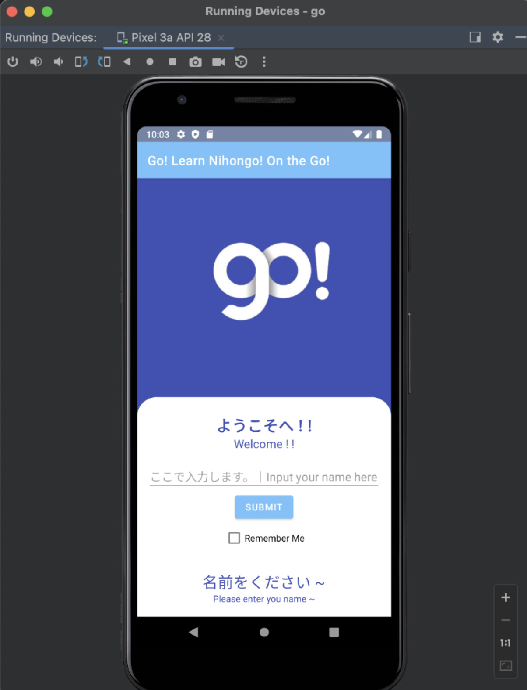
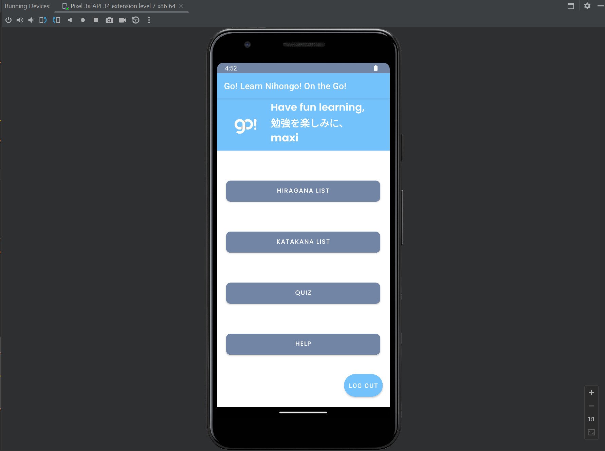
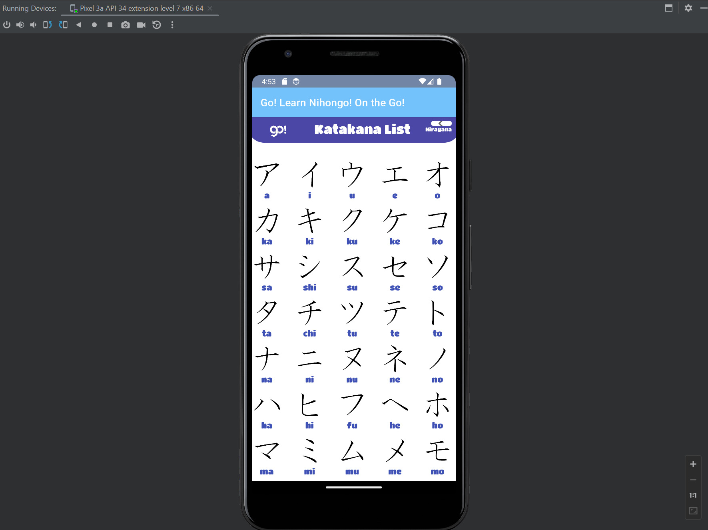
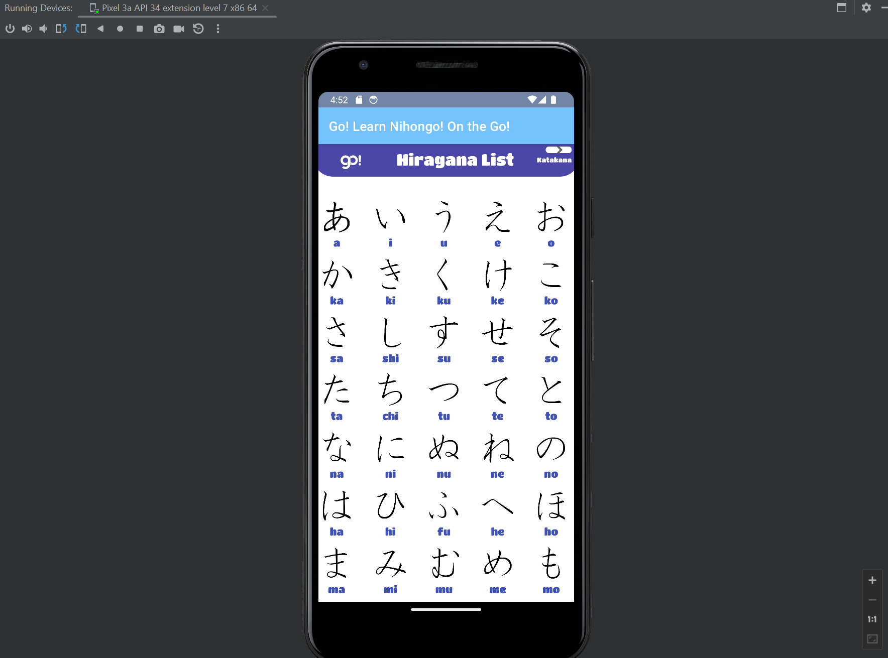
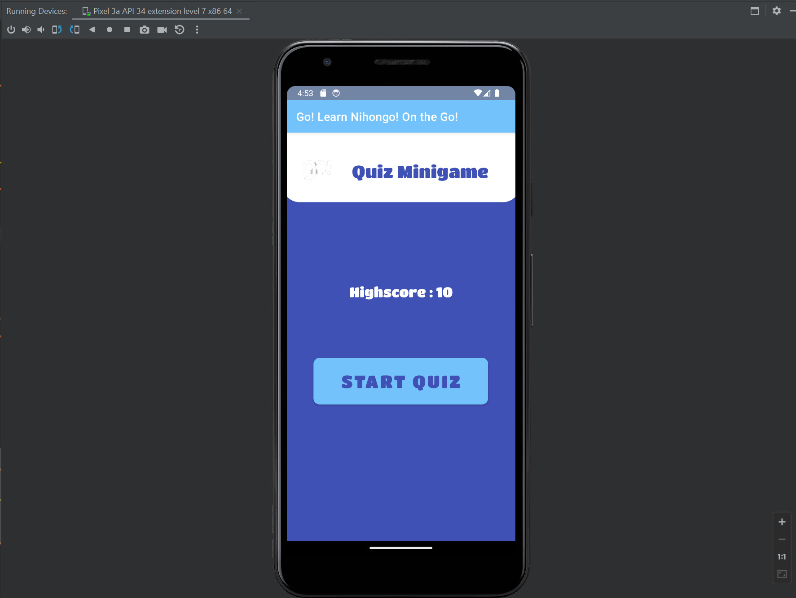
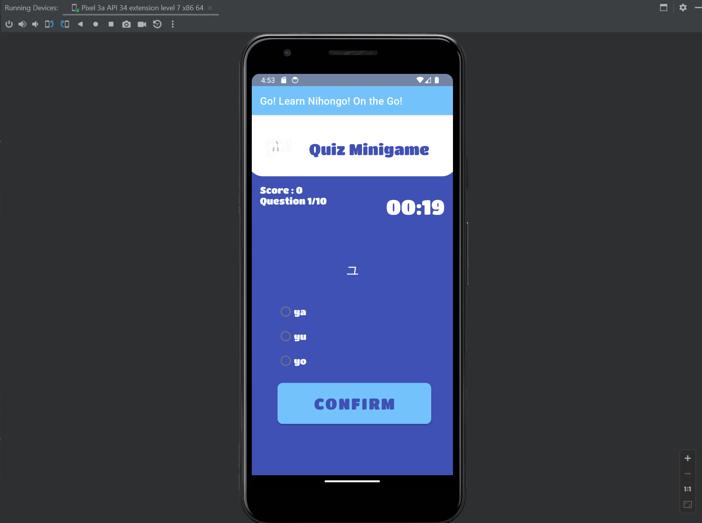
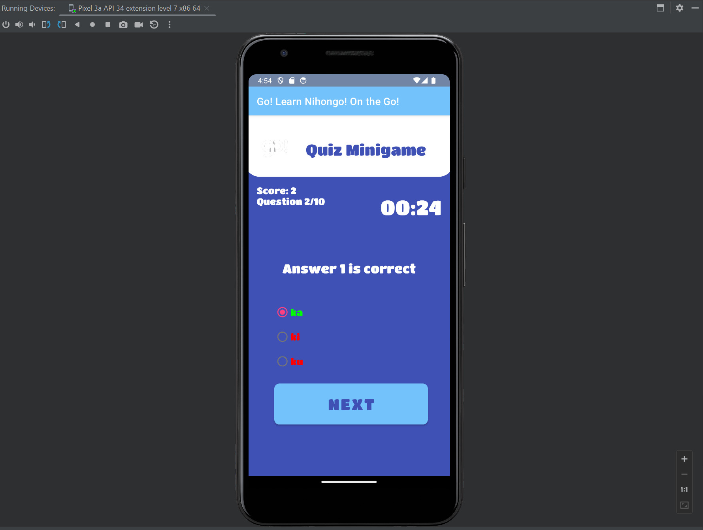

# Go!

# Learn Nihongo on the GO!

Learn Nihongo on the GO! GO! is an Android application programmed in kotlin and designed for learning the Japanese characters of Hiragana and Katakana.

Log-In Feature:
The application offers a simple log-in feature where users input their name. This information is saved in shared preferences if the "Remember Me" checkbox is selected. A log-out button is also available.

Main Menu Bar:
Upon log-in, the main menu displays a bar showing the user's name if it has been entered.

Character List:
The app features a list that displays all Hiragana and Katakana characters. This list uses Android's RecyclerView and sources its string information from resources. Static images are used to illustrate each character.

Mini Quiz:
The application includes a mini quiz that uses SQLite database functions to operate. Questions are designed to test the user's knowledge of Hiragana and Katakana.

Highscore Feature:
Users can keep track of their highest score in the mini quiz. This highscore is saved in shared preferences.

Timer Function:
A 30-second timer is incorporated into the mini quiz, encouraging users to answer questions within a set time frame.

Scoring Metrics:
The mini quiz displays a real-time score and the total number of questions answered by the user.

Overall, Learn Nihongo on the GO! is a software application for individuals interested in learning or improving their understanding of Hiragana and Katakana characters! 

## Go-Homepage

## Homepage

## Katakana List

## Hiragana List

## Quiz Starting

## Quiz Functionality #1

## Quiz Functionality #2

